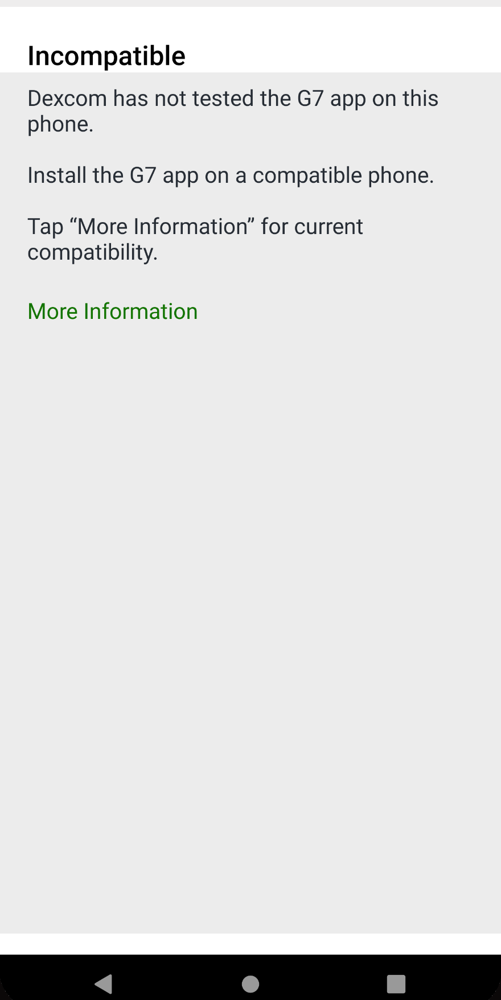
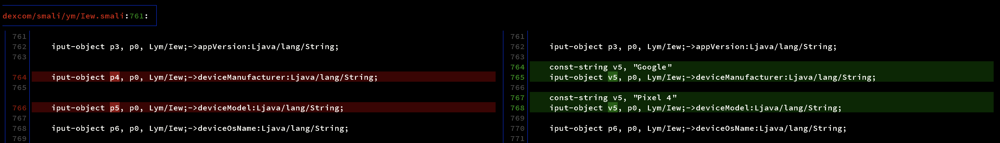

# ☢️☢️☢️ USE AT YOUR OWN RISK | HIGHLY EXPERIMENTAL 🧪🧪🧪

ALL INFORMATION AND OFFERED RESOURCES ARE HIGHLY EXPERIMENTAL AND NOT TESTED.

# Dexcom G7 APK-Patcher

Build your own android based `Dexcom G7.apk` without compatibility checks to run it on any device.

## ⏬ Download

Just download the modified `.apk` and install it on your phone.

You can find the most recent pre-build `.apk` [here](https://github.com/DiaKEM/dexcom-g7-apk-patcher/releases/latest)!

## What it solves?

It solves exactly this:



## Introduction

`Dexcom G7 APK-Patcher` is a simple tool which allows you to modify the official `.apk`-file. The patched `.apk` will disable compatibility checks 
to allow you the usage of any current android smartphone.

There were also similar approaches for the G6 `.apk` which offered the same capability. If you are interested you can just check it [here](https://www.reddit.com/r/dexcom/comments/fqvpsf/oc_build_your_own_dexcom_app_update_base_version/).

## Usage

### Requirements

* apktool
* apksigner
* git
* eventually more stuff :)

### Build

After installing all requirements you can proceed as following:

* Download official `Dexcom G7.apk`
* Place it in the root and name it `dexcom.apk`
* Run `bin/build.sh`
* Congratulations - you just have an patched `Dexcom G7.apk` without compatibility checks under `dexcom-mod.apk`

## Patches / Changes / Modifications

The official `.apk` receives only small changes to disable the compatibility check. For this purpose only one single file will be modified.
This file seems to be responsible for holding device specific data beside of app information. The applied patch only sets static values for `DeviceManufacturer`
and `DeviceModel` to overcome the compatibility check:




As you can see these values will be statically set to `Google` and `Pixel 4`.

## Technical background

The compatibility of dexcom will be done by some specific service. Therefore the app will collect device and app information and send it to this web-service.
The service then will check the information and respond to it.

### The HTTP Request

```http_request
POST https://watch.share-eu.dexcom.com/AppCompatibilityWebServices/Services/CheckValidity?applicationId=822b7625-68bd-4759-b1e7-24d7d1b44d28
Content-Type: application/json

{
  "AppName": "Dexcom G7",
  "AppVersion": "1.3.2.3326",
  "DeviceManufacturer": "Google",
  "DeviceModel": "Pixel 4",
  "DeviceOsName": "Android",
  "DeviceOsVersion": "11",
  "AppNumber": "SW12299"
}

```

If the information are okay the service will answer with:

```
{
  "Validity": "ValidEnvironment",
  "MessageId": "XXXXXXXX-XXXX-XXXX-XXXX-XXXXXXXXXXXX",
  "MessageCacheId": "XXXXXXXX-XXXX-XXXX-XXXX-XXXXXXXXXXXX"
}
```

Otherwise it will just say:

```
{
  "Validity": "InvalidUnsupportedEnvironment",
  "MessageId": "XXXXXXXX-XXXX-XXXX-XXXX-XXXXXXXXXXXX",
  "MessageCacheId": "XXXXXXXX-XXXX-XXXX-XXXX-XXXXXXXXXXXX"
}

```

## The solution

What if it is possible to just set these values statically? Can we simply lie so that the compatibility service does not complain anymore?
This was the simple approach here. After disassembling the official `.apk` and checked the code i identified `dexcom/smali/ym/Iew.smali` as
main information unit for this purpose. And finally the problem was solved by adding two lines of code and changing another two.

## Contributing

Contributions are what make the open source community such an amazing place to learn, inspire, and create. 
Any contributions you make are greatly appreciated.

If you have a suggestion that would make this better, please fork the repo and create a pull request. 
You can also simply open an issue with the tag "enhancement". Don't forget to give the project a star! Thanks again!

* Fork the Project
* Create your Feature Branch (git checkout -b feature/AmazingFeature)
* Commit your Changes (git commit -m 'Add some AmazingFeature')
* Push to the Branch (git push origin feature/AmazingFeature)
* Open a Pull Request

### Standards

This project is using commit hooks to ensure code quality and prevent code smell. This will be done by ESLint and Prettier.
If there are noticeable problems with your code the commit will be rejected. Furthermore convential commits are used to
standardize commit messages to generate changelogs automatically.

## License

Distributed under the MIT License.

## Contact

Selcuk Kekec

E-mail: [khskekec@gmail.com](khskekec@gmail.com)
